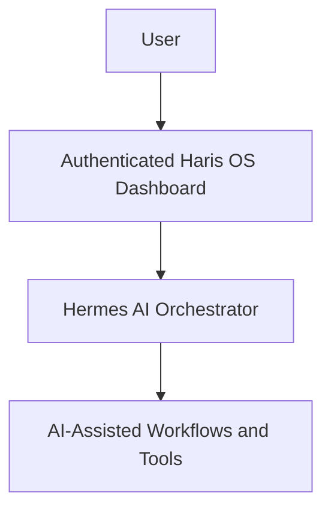

# Haris OS

A personal, self-hosted AI agent and automation workspace.

## Overview

Haris OS brings AI agents and automation together in a unified interface for personal AI-assisted workflows. Hermes is the primary AI orchestrator, and an authenticated web dashboard provides the workspace.

## What Is Haris OS?

Haris OS is designed as a personal workspace for interacting with AI-assisted workflows. It combines a high-level orchestration concept with a web dashboard, while keeping the production application and operational infrastructure private.

## Core Capabilities

- A personal workspace for AI agents and automation
- A unified interface for interacting with AI-assisted workflows
- An authenticated web dashboard
- Hermes as the primary AI orchestrator

## Hermes

Hermes is the primary AI orchestrator in Haris OS. This showcase describes its role at a high level and does not document private implementation details.

## Dashboard / Workspace

The authenticated web dashboard is the personal workspace for interacting with AI-assisted workflows. The production dashboard remains private.

## High-Level Architecture

The diagram shows conceptual roles only; it does not describe production infrastructure or implementation details.

## Project Philosophy

Haris OS is a personal, self-hosted workspace. Its public description focuses on the project’s purpose and high-level experience, while production operations remain private.

## Current Project Status

This repository is the public project showcase. The production application and operational infrastructure remain private; this repository is not the production source repository.

## Security & Privacy

Production source code, configuration, credentials, deployment details, infrastructure information, and private data are intentionally excluded from this public showcase.

## About This Repository

This repository provides a concise public overview of Haris OS. It is separate from the private production application and does not contain production source or operational configuration.
